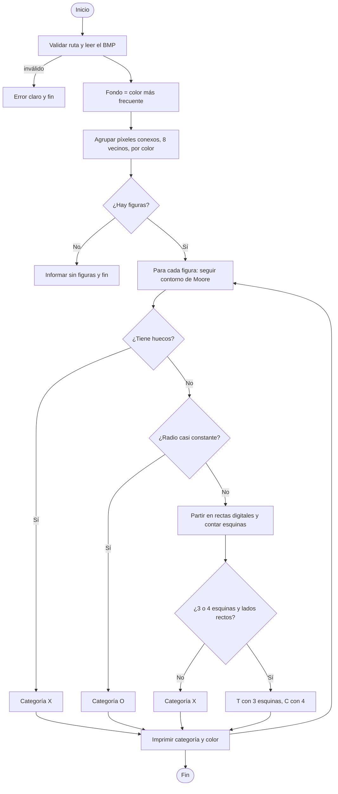

# Reporte técnico

## Proyecto 1 · Reconocimiento de Figuras

Equipo: Cyberdowns  
Integrantes: Bruno Alonso Oñate Jimenez, Diego Avalos, Paulino Perez, Santiago Morales Bofill  
Modelado y Programación · Grupo 7078 · Semestre 2027-1  
Profesor: José de Jesús Galaviz Casas   


## 1. Definición del problema

**Entrada.** La ruta de una imagen .bmp que contiene una o más figuras geométricas de color sólido, sobre un fondo de un solo color. Los colores de las figuras son distintos entre sí y del fondo, no hay degradados ni suavizado en los bordes, las figuras no se traslapan y su tamaño, rotación y posición son arbitrarios.

**Salida.** Una línea por cada figura encontrada, con su categoría y su color en hexadecimal (#RRGGBB), por ejemplo `Triangulo - Color: #0000FF`. Las categorías son:

- **C**: cuadriláteros (cuadrados, rectángulos, rombos, trapezoides).
- **T**: triángulos (equiláteros, isósceles, escalenos, rectángulos).
- **O**: círculos.
- **X**: cualquier otra figura.

Si la entrada no es válida, el programa avisa con un mensaje claro en lugar de terminar con un error críptico.


## 2. Arsenal

- **Java 21 y su biblioteca estándar** (java.io, java.util). El programa no usa bibliotecas externas.
- **Apache Ant** (build.xml) para compilar, empaquetar el jar y ejecutar: `ant jar`, `ant run -Dimg=ruta.bmp`.

**Por qué.**

- Java es orientado a objetos, lo que facilita separar responsabilidades en paquetes (io, procesamiento, clasificacion, modelo) y documentar el diseño, que es lo que se evalúa en la materia.
- Un jar corre igual en Windows, Linux y macOS desde terminal, sin instalar dependencias. Ant ya integra compilación, empaquetado y ejecución.


## 3. Análisis del problema


### 3.1 Supuestos

- El fondo es el color más frecuente de la imagen (es uniforme y ocupa más área que cualquier figura).
- Cada figura es una región conexa de un color sólido, distinto del fondo y de las demás figuras.
- No hay anti-aliasing, así que dos píxeles del mismo color pertenecen a la misma figura si están conectados.
- Las figuras no se traslapan.
- El BMP es de 24 o 32 bits y sin compresión.


### 3.2 Casos límite identificados

| Caso | Cómo se maneja |
|---|---|
| Ancho que no es múltiplo de 4 (cada fila del BMP se rellena a 4 bytes) | El lector calcula el tamaño real de fila; probado con anchos de 201 y 203 px. |
| BMP guardado de arriba hacia abajo (alto negativo) | Se detecta el signo del alto y se invierte el orden de filas. |
| BMP de 32 bits | Se lee con 4 bytes por píxel e ignora el canal alfa. |
| Archivo inexistente, sin extensión .bmp, de texto renombrado, truncado, de 8 bits o comprimido | Se muestra un mensaje de error claro; el programa no lanza excepciones sin controlar. |
| Imagen sin figuras (solo fondo) | Informa "No se encontraron figuras en la imagen." |
| Fondo que no es blanco | El fondo se calcula como el color más frecuente; probado con fondo oscuro. |
| Vértice muy agudo que deja un píxel unido solo en diagonal | El agrupamiento usa vecindad de 8; con vecindad de 4 ese píxel salía como una figura extra "Otro". |
| Figura con hueco (por ejemplo un anillo) | Se detecta con el conteo de Pick y se clasifica como X. |
| Círculo pixelado que parece un polígono de muchos lados | Se revisa el círculo antes que las esquinas, midiendo la variación del radio (menos de 2%). |
| Figuras de menos de unos 25 px | Limitación conocida: la forma ya no se distingue y puede haber errores. |
| Cuadrilátero cóncavo o ángulos interiores de más de 150° | Un cóncavo de 4 lados se reporta como C; ángulos mayores a 150° no se cuentan como esquina. |


### 3.3 Requisitos funcionales

- **1.** Recibir por línea de comandos la ruta de una imagen .bmp.
- **2.** Leer BMP sin compresión de 24 y 32 bits, con filas rellenadas y en cualquier orientación.
- **3.** Determinar el color de fondo.
- **4.** Separar cada figura del fondo y de las demás.
- **5.** Clasificar cada figura como C, T, O o X sin importar su tamaño, rotación o posición.
- **6.** Reportar, por figura, su categoría y su color en hexadecimal.
- **7.** Informar cuando la imagen no contiene figuras.
- **8.** Rechazar con un mensaje claro cualquier entrada inválida.


### 3.4 Requisitos no funcionales

- **1. Fiabilidad.** Ante una entrada inválida el programa muestra un mensaje claro en lugar de una traza de excepción (toda excepción se captura en el programa principal).
- **2. Desempeño.** Procesa una imagen de 2000×2000 px con tres figuras en menos de 1 segundo, incluyendo el arranque de la JVM (medido: 0.6 a 0.75 s; una imagen de 480×320 tarda cerca de 0.3 s). Las mediciones se hicieron en un entorno de pruebas, no en una computadora de usuario.
- **3. Invariancia.** El resultado no depende de la rotación, posición ni tamaño de la figura (probado con figuras de 30 px o más).
- **4. Portabilidad.** Funciona desde terminal con Java y Ant, sin dependencias externas.
- **5. Mantenibilidad.** Código dividido en paquetes con una responsabilidad cada uno, constantes con nombre y documentación en docs/clasificacion.md.
- **6. Verificabilidad.** Banco de 17 imágenes con resultados esperados y un script que los comprueba con un solo comando.


## 4. Selección de la mejor alternativa


### 4.1 Algoritmo elegido

El programa trabaja en dos etapas. Primero **dividir**: toma como fondo el color más comun y agrupa, con una búsqueda en anchura sobre sus vecinos, los píxeles conexos del mismo color. Cada grupo es una figura. Después **clasifica** cada figura midiendo solo su borde:

1. Sigue el contorno con el algoritmo de vecindad de Moore.
2. Detecta huecos: por el teorema de Pick, un polígono sin huecos tiene área + borde/2 + 1 puntos; si la figura tiene menos píxeles, tiene un hueco y es X.
3. Detecta círculos: la distancia del borde al centro varía menos de 2% (en un octágono varía 2.2% o más y en un cuadrado cerca de 11%).
4. Parte el borde en rectas digitales (franjas de grosor máximo 1.5 px, con búsqueda binaria del extremo más lejano de cada segmento).
5. Cuenta esquinas: uniones donde la dirección gira 30° o más en una ventana corta, y verifica que los lados entre esquinas sean rectos.
6. Decide: 3 esquinas es T, 4 es C, y cualquier otra cosa es X.


### 4.2 Alternativas y por qué se prefirió esta

| Alternativa | Limitación frente a la elegida |
|---|---|
| Comparar la figura con su rectángulo envolvente (porcentaje de relleno) | Cambia con la rotación: un cuadrado girado 45° se parece a un rombo o a un triángulo. |
| Aproximar el polígono con Douglas-Peucker | Depende de un umbral epsilon: pequeño, los escalones de los bordes inclinados generan vértices falsos; grande, se funden esquinas reales. |
| Transformada de Hough para rectas | Es más costosa y exige umbrales de votación; en bordes pixelados produce picos duplicados y hay que agruparlos después. |
| Circularidad (4·pi·A/P^2) como único criterio | Separa bien el círculo, pero no distingue un triángulo de un cuadrilátero ni de otras figuras. |

**Por qué la elegida.** Opera solo con enteros y geometría, es invariante a rotación, posición y tamaño, no necesita datos de entrenamiento y sus parámetros tienen significado geométrico (grosor de una recta digital en píxeles, grado de giro de una esquina, porcentaje de variación del radio). Su costo es que es más compleja de implementar y que sus constantes se ajustaron con pruebas; con figuras de menos de unos 25 píxeles falla.

**Pruebas.** Se probaron 19 tipos de figura en 7 tamaños y 24 rotaciones cada una: con figuras de 30 px o más, los aciertos fueron de 97 a 100% por tipo (detalle en docs/clasificacion.md). Además, el banco de tests/banco_imagenes (17 casos) se verifica con tests/verificar.py: 17 de 17 correctos.


## 5. Diagrama de flujo y pseudocódigo




### Pseudocódigo

```
PROGRAMA principal(args)
  si |args| != 1:                       mostrar uso y terminar
  si el archivo no existe o no es .bmp: mostrar error y terminar
  imagen <- leerBMP(ruta)               // error claro si el BMP no es valido
  fondo  <- color mas frecuente de la imagen
  figuras <- agrupar(imagen, fondo)
  si figuras esta vacia: informar "No se encontraron figuras" y terminar
  para cada figura en figuras:
      categoria <- clasificar(figura)
      imprimir categoria y color de la figura en #RRGGBB

FUNCION agrupar(imagen, fondo)
  visitado <- matriz de falsos
  para cada pixel p en orden fila-columna:
      si color(p) != fondo y no visitado[p]:
          figura <- BFS desde p por vecinos (8) del mismo color
          agregar figura a la lista

FUNCION clasificar(figura)
  borde <- contornoMoore(figura)
  si la figura tiene huecos (conteo de Pick):    devolver X
  si variacionDelRadio(borde) < 2%:              devolver O
  segmentos <- partir borde en rectas digitales  // grosor <= 1.5 px
  esquinas  <- uniones donde el borde gira >= 30 grados en una
               ventana corta (uniones pegadas cuentan como una)
  si |esquinas| es 3 o 4 y cada lado entre esquinas es recto
     (desviacion <= 3 px o 4% del lado):
      devolver T si 3 esquinas, C si 4
  devolver X
```
